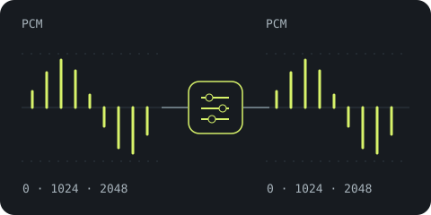
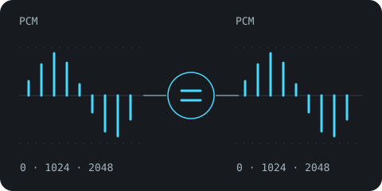
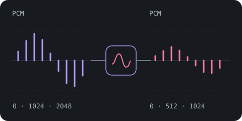

# Comprendre le traitement audio d’Aède

DSP signifie **traitement numérique du signal** : des calculs sur le son pendant la lecture. Le DSP actuel change le flux de lecture, jamais le fichier original ni ses tags. Il ne remplace pas le volume d’écoute. La commande locale `aede play` démarre sans effets ; `--playback=dsp` ou des effets explicites non neutres choisissent le traitement partagé. Son mode bit-perfect strict utilise plutôt des échantillons source typés et un chemin exact sans traitement. La route PCM native authentifiée garde son contrat distinct de PCM traité.

## Trois modes de lecture locale

Ces schémas représentent des échantillons PCM synthétiques, pas une mesure du périphérique. Ils décrivent `aede play` en local ; les clients réseau gardent leurs contrats de lecture distincts.

| Mode | Illustration du signal | Comportement |
| --- | --- | --- |
| **Sans effets** — par défaut, `without-effects` |  | Normalisation et tonalité choisies désactivées. Privilégier la fréquence source et des échantillons exacts ; signaler les adaptations nécessaires de fréquence, canaux ou précision. Ce n’est pas une garantie bit-perfect stricte. |
| **Bit-perfect strict** — `bit-perfect` |  | Préserver les échantillons des sources admises sans étape de modification. Refuser les sources ou sorties incompatibles ; exiger un périphérique explicitement choisi. |
| **DSP** — `dsp` |  | Appliquer la normalisation et la tonalité choisies, avec marge, protection de sortie et conversion si nécessaire. Conserver les fichiers originaux intacts. |

Le premier profil strict accepte le FLAC natif et le WAV PCM entier, 16/24 bits mono/stéréo, via ALSA directe sur Linux glibc. macOS et Windows sont actuellement refusés en mode strict. Le chemin logiciel est implémenté et testé ; compilation/exécution sur Linux réel et comparaison d’un retour numérique restent à valider. Voir [modes de lecture et sortie stricte](../cli/play.md#playback-policies-and-strict-output) pour les commandes, la découverte des sorties et les limites.

Le MD5 audio FLAC présent est contrôlé dans **les trois modes**, sur les entiers originaux décodés avant tout DSP. Son verdict nécessite un décodage complet et ne certifie pas la sortie du périphérique ; suivre [le schéma MD5 et les états de vérification](../integrity.md#flac-audio-md5-during-playback).

## Suivre un échantillon jusqu’à la sortie

1. Le décodeur transforme l’audio du fichier en PCM : une suite de nombres appelés échantillons. Une trame contient un échantillon par canal ; en stéréo, gauche et droite avancent ensemble.
2. Un agencement multicanal connu peut être ramené en stéréo, sans LFE, avec une réduction prudente du niveau.
3. La sortie native choisit format/fréquence compatibles ; au besoin, un convertisseur à bande limitée change la fréquence en conservant son état.
4. Une décision fixe de normalisation par piste/album ajuste le niveau, dans la limite permise par les crêtes.
5. Les réglages larges de graves/aigus appliquent leur correction, avec une marge supplémentaire en cas de hausse.
6. Une protection finale borne les valeurs dépassant la pleine échelle et compte ses interventions.
7. Les indicateurs observent le PCM transmis ; la sortie l’envoie au périphérique. En entier natif DSP, un dither TPDF accompagne la quantification ; en flottant, cette conversion est contournée.

Cet ordre décrit le chemin DSP. Sans effets contourne normalisation et tonalité choisies, privilégie la fréquence source et évite le dither lorsqu’un échantillon entier natif est exactement représentable ; conversion/réduction de canaux/protection nécessaires peuvent rester actives et sont signalées. Le mode strict contourne toute modification et refuse les sources ou sorties incompatibles. La capture du volume manquant en DSP observe le **PCM source avant traitement**, pour ne pas mesurer son propre gain/égalisation comme source. Les mesures de sortie voient le PCM transmis **avant** conversion du périphérique. Elles ne mesurent pas vos enceintes.

La [route PCM native](../server/playback.md) décode également la source, ramène les canaux connus en stéréo, convertit la fréquence au besoin et applique normalisation, tonalité/marge et protection finale. Son client gère le périphérique audio et sa conversion finale. Lecture d’une piste et files finies réutilisent les données de volume existantes sans apprendre de nouvelles mesures ; les transitions compatibles partagent l’état de traitement. [Subsonic/OpenSubsonic](../server/subsonic.md) transfère le fichier audio encodé original sans DSP serveur ; son client gère le décodage et ses éventuels traitements de lecture.

## Les réglages actuels

```sh
aede play "Un Album"
aede play "Un Album" --playback dsp
aede play "Un Album" --normalize album --bass 3 --treble -2
aede play /chemin/vers/morceau.flac --normalize off --bass 0 --treble 0
```

Remplacez noms/chemins par les vôtres. Le défaut local désactive normalisation et tonalité. En DSP, la normalisation automatique utilise album pour un album catalogué, track sinon ; `--normalize off|track|album` change ce choix. Track/album explicite ou graves/aigus non nuls implique DSP si le mode n’était pas précisé, et produit un conflit avec without-effects/bit-perfect explicite. Graves/aigus acceptent chacun −12 à +12 dB, avec zéro par défaut. Zéro contourne exactement les filtres ; normalize off seul **ne désactive pas** une tonalité explicitement choisie ni la protection ordinaire.

La CLI ne propose actuellement ni cible LUFS réglable, ni éditeur paramétrique, ni limiteur, ni profil de convolution, ni fréquence manuelle, ni interrupteur de dither. Ce ne sont pas des options cachées à deviner. La [référence play](../cli/play.md) couvre sélections et options ; les [diagnostics de sortie](output.md) montrent ce qui a réellement été exécuté.

## Choisir votre question

| Question | Guide |
| --- | --- |
| Pourquoi deux albums ont-ils des niveaux différents ? | [Normalisation](normalization.md) et [mesures](measurements.md). |
| Comment ajuster graves ou aigus ? | [Tonalité](tone.md) et [marge de niveau](headroom.md). |
| Que devient un fichier 5.1 ? | [Canaux](channels.md). |
| Pourquoi la sortie passe-t-elle de 96 à 48 kHz ? | [Conversion de fréquence](resampling.md). |
| Les échantillons entiers sont-ils transmis intacts ? | [Modes de lecture](../cli/play.md#playback-policies-and-strict-output) et [sortie entière](dither.md). |
| Les transitions d’album sont-elles gapless ? | [Lecture continue](continuity.md). |
| Que signifient les barres animées ? | [Spectre](spectrum.md). |
| Quels effets Premium pourrait-il ajouter ? | [Futur Premium](premium.md). |

Les diagrammes interactifs du site utilisent des signaux synthétiques pédagogiques. Ce ne sont ni des mesures de votre matériel ni des commandes du DSP audio. La validation technique figure dans la [revue DSP](../../coding/dsp-review.md) et la [conception de lecture](../../design/playback.md).
